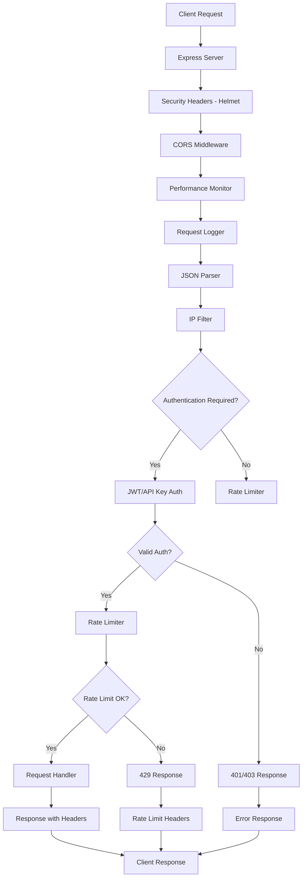

# 🏗️ System Overview

High-level architecture and design principles of the API Rate Limiter service.

## 🎯 System Purpose

The API Rate Limiter is an enterprise-grade Node.js service that provides rate limiting as a service for any API. It acts as a protective middleware layer that:

- Controls API access rates using multiple algorithms
- Authenticates and authorizes requests via JWT and API keys
- Monitors performance and usage patterns
- Provides graceful degradation and high availability

## 🏛️ Architecture Overview

### Core Components

```
┌─────────────────────────────────────────────────────────┐
│                    Client Requests                      │
├─────────────────────────────────────────────────────────┤
│                  Load Balancer (Optional)               │
├─────────────────────────────────────────────────────────┤
│               API Rate Limiter Service                  │
│  ┌─────────────┐ ┌─────────────┐ ┌─────────────────┐   │
│  │   Express   │ │ Middleware  │ │   Dashboard     │   │
│  │   Server    │ │   Stack     │ │     (Web UI)    │   │
│  └─────────────┘ └─────────────┘ └─────────────────┘   │
├─────────────────────────────────────────────────────────┤
│  ┌─────────────┐ ┌─────────────┐ ┌─────────────────┐   │
│  │    Redis    │ │  Statistics │ │   Performance   │   │
│  │   Cluster   │ │   Engine    │ │    Monitor      │   │
│  │ (Optional)  │ │             │ │                 │   │
│  └─────────────┘ └─────────────┘ └─────────────────┘   │
├─────────────────────────────────────────────────────────┤
│                Protected API Services                   │
└─────────────────────────────────────────────────────────┘
```

### Technology Stack

| Layer | Technology | Purpose |
|-------|------------|---------|
| **Runtime** | Node.js 16+ | JavaScript runtime with high performance |
| **Framework** | Express.js | Web application framework |
| **Language** | TypeScript | Type-safe development with static analysis |
| **Database** | Redis (optional) | High-performance key-value store |
| **Authentication** | JWT + API Keys | Dual authentication system |
| **Testing** | Jest + Supertest | Comprehensive testing framework |
| **Deployment** | Docker + Docker Compose | Containerized deployment |

## 🔄 Data Flow Architecture

### Request Processing Pipeline



### Middleware Stack (Order Matters)

1. **Helmet** - Security headers (CSP, HSTS, etc.)
2. **CORS** - Cross-origin request handling
3. **Performance Monitor** - Request timing and metrics
4. **Morgan Logger** - HTTP request logging
5. **JSON Parser** - Request body parsing
6. **IP Filter** - Whitelist/blacklist enforcement
7. **JWT Authentication** - Token validation (optional)
8. **API Key Authentication** - Key validation (optional)
9. **Rate Limiter** - Request throttling and protection
10. **Request Handler** - Business logic processing

## 🗂️ Component Architecture

### Core Modules

```
src/
├── index.ts                    # Application entry point
├── middleware/                 # Express middleware stack
│   ├── apiKeyAuth.ts          # API key authentication & validation
│   ├── jwtAuth.ts             # JWT token authentication
│   ├── optimizedRateLimiter.ts # High-performance rate limiting
│   ├── ipFilter.ts            # IP whitelist/blacklist
│   ├── logger.ts              # Request/response logging
│   └── validation.ts          # Input validation schemas
├── utils/                     # Core utilities and services
│   ├── redis.ts               # Redis client with Lua scripts
│   ├── stats.ts               # Statistics with circular buffers
│   ├── performance.ts         # Performance monitoring
│   ├── apiKeys.ts             # API key management system
│   └── logger.ts              # Application logging
└── types/                     # TypeScript type definitions
    └── index.ts               # Shared interfaces and types
```

### Data Storage Architecture

**Redis (Production)**:
- Rate limiting counters and windows
- API key metadata and usage statistics
- Session data and JWT blacklists
- Performance metrics and statistics

**In-Memory (Development/Fallback)**:
- LRU caches for rate limiting
- Circular buffers for statistics
- API key storage and validation
- Performance monitoring data

## 🚀 Performance Design

### Optimization Strategies

**Circular Buffers**:
- O(1) operations for statistics calculation
- Fixed memory footprint prevents leaks
- Efficient sliding window calculations

**LRU Caches**:
- Bounded memory usage for endpoint tracking
- Automatic eviction of old data
- Fast lookup and insertion operations

**Redis Lua Scripts**:
- Atomic operations prevent race conditions
- Reduced network round trips
- Consistent state management

**Caching Strategy**:
- 1-second cache for expensive calculations
- Memory-efficient data structures
- Lazy initialization and cleanup

### Memory Management

```typescript
// Example: Bounded LRU cache with automatic cleanup
class BoundedLRUCache<T> {
  private maxSize = 1000;
  private cache = new Map<string, T>();
  
  set(key: string, value: T): void {
    if (this.cache.size >= this.maxSize) {
      const firstKey = this.cache.keys().next().value;
      this.cache.delete(firstKey);
    }
    this.cache.set(key, value);
  }
}
```

## 🔄 Scalability Architecture

### Horizontal Scaling

**Stateless Design**:
- No server-side session storage
- JWT tokens carry user context
- Redis handles shared state

**Load Balancing**:
- Multiple service instances
- Consistent hashing for Redis
- Health check endpoints

**Database Scaling**:
- Redis cluster with automatic failover
- Master-slave replication
- Cross-datacenter synchronization

### Vertical Scaling

**Resource Optimization**:
- Efficient memory usage patterns
- CPU-optimized algorithms
- I/O minimization strategies

**Performance Monitoring**:
- Real-time metrics collection
- Automatic alerting on thresholds
- Performance trend analysis

## 🛡️ Security Architecture

### Defense in Depth

```
┌─────────────────────────────────────────┐
│           Network Security              │
│  ┌─────────────────────────────────┐   │
│  │        Application Security     │   │
│  │  ┌─────────────────────────┐   │   │
│  │  │     Data Security       │   │   │
│  │  │  ┌─────────────────┐   │   │   │
│  │  │  │  Core Service   │   │   │   │
│  │  │  └─────────────────┘   │   │   │
│  │  └─────────────────────────┘   │   │
│  └─────────────────────────────────┘   │
└─────────────────────────────────────────┘
```

**Network Security**:
- IP filtering and geographic restrictions
- HTTPS/TLS encryption in transit
- VPC and firewall configurations

**Application Security**:
- JWT and API key authentication
- Input validation and sanitization
- Rate limiting and abuse prevention

**Data Security**:
- Encryption at rest for sensitive data
- Secure key management and rotation
- Audit logging and monitoring

## 🔍 Monitoring Architecture

### Observability Stack

**Metrics Collection**:
- Request/response times (P50, P95, P99)
- Error rates and status codes
- Resource utilization (CPU, memory)
- Rate limiting statistics

**Logging Strategy**:
- Structured JSON logging
- Correlation IDs for request tracking
- Security event logging
- Performance event logging

**Health Monitoring**:
- Service health endpoints
- Dependency health checks
- Automatic alerting on failures
- Dashboard visualization

### Real-time Dashboard

The web dashboard provides:
- Live request statistics
- Performance metrics visualization
- API key management interface
- Rate limiting configuration
- System health monitoring

## 🔧 Configuration Architecture

### Environment-Driven Configuration

```typescript
interface ApiRateLimiterConfig {
  server: {
    port: number;
    host: string;
    environment: 'development' | 'production';
  };
  
  rateLimiting: {
    defaultAlgorithm: 'token-bucket' | 'sliding-window' | 'fixed-window';
    defaultWindowMs: number;
    defaultMaxRequests: number;
  };
  
  security: {
    jwtSecret: string;
    jwtExpiresIn: string;
    apiKeySecret: string;
    ipWhitelist: string[];
    ipBlacklist: string[];
  };
  
  redis: {
    enabled: boolean;
    host: string;
    port: number;
    password?: string;
    db: number;
  };
}
```

### Configuration Validation

- Environment variable validation at startup
- Type-safe configuration interfaces
- Default values for optional settings
- Production readiness warnings

## 🚨 Error Handling Architecture

### Graceful Degradation

**Redis Unavailable**:
- Automatic fallback to in-memory storage
- Continued service operation
- Performance impact warnings

**High Load Conditions**:
- Circuit breaker patterns
- Adaptive rate limiting
- Resource protection mechanisms

**Authentication Failures**:
- Secure error responses
- Audit logging
- Brute force protection

### Error Response Strategy

```typescript
interface ErrorResponse {
  error: string;           // Error type
  message: string;         // Human-readable message
  timestamp: string;       // ISO timestamp
  requestId: string;       // Correlation ID
  retryAfter?: number;     // For rate limiting errors
  details?: any[];         // Validation details
}
```

## 🎯 Design Principles

### High Availability

- Stateless service design
- Graceful failure handling
- Automatic health monitoring
- Fast failure detection and recovery

### Performance

- Sub-millisecond response times
- Efficient memory usage
- Optimized algorithms
- Minimal resource footprint

### Security

- Defense in depth
- Principle of least privilege
- Secure by default configuration
- Comprehensive audit logging

### Maintainability

- Clean code architecture
- Comprehensive testing
- Clear documentation
- Modular design patterns

---

**Next**: [🔄 Data Flow](./Data-Flow.md) or [⚡ Performance Design](./Performance-Design.md)
